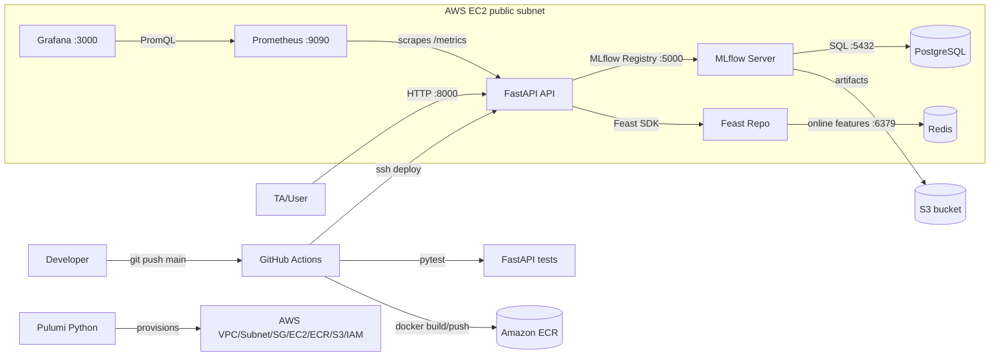

# ModelServe Engineering Documentation

## 1. System Overview

ModelServe is a small production-style ML serving platform for credit-card fraud prediction. A user submits an entity ID to the FastAPI service, the service fetches the latest online features for that card from Feast backed by Redis, applies the currently promoted MLflow model, and returns a prediction with the model version and request timestamp.

The design favors simplicity, reproducibility, and demo reliability over high availability. The chosen production topology is a single AWS EC2 instance running the container stack with Docker Compose, while Pulumi provisions the supporting AWS resources. This keeps networking and operational reasoning clear for a capstone while still demonstrating real IaC, registry, object storage, CI/CD, and monitoring practices.

The core stack is FastAPI, MLflow, PostgreSQL, Feast, Redis, Prometheus, Grafana, Docker, Pulumi, ECR, S3, and GitHub Actions. PostgreSQL stores MLflow metadata, S3 is available for production MLflow/Feast artifacts, Redis serves online features, Prometheus scrapes `/metrics`, and Grafana auto-loads the ModelServe dashboard.

## 2. Architecture Diagrams

Diagram source is committed at [`docs/diagrams/architecture.mmd`](diagrams/architecture.mmd).

Local development uses the same Docker Compose topology on the developer machine. The only topology difference is that local MLflow artifacts are stored in the `mlflow_artifacts` Docker volume, while production can point `MLFLOW_DEFAULT_ARTIFACT_ROOT` at S3.

Network ports exposed for demo access are `8000` for FastAPI, `5000` for MLflow, `9090` for Prometheus, and `3000` for Grafana. PostgreSQL and Redis are exposed in local Compose for debugging, but in a production hardening pass they should be private to the Docker network or instance security group.

## 3. Architecture Decision Records

### ADR-1: Single-Node AWS EC2 Deployment Topology

**Context:** The capstone allows Poridhi-only, AWS-only, or hybrid deployments. The platform needs to be easy to explain and recover during a short live demo.

**Decision:** Run the full container stack on one Pulumi-provisioned AWS EC2 instance, with ECR for the FastAPI image and S3 available for artifacts.

**Rationale:** A single node avoids cross-host networking failure modes and keeps the demo path clear: one public IP, one Docker Compose stack, and one place to inspect logs. It still exercises AWS compute, IAM, ECR, S3, security groups, and Pulumi.

**Trade-offs:** This creates a single point of failure and resource contention between MLflow, API, Redis, PostgreSQL, and monitoring. A real deployment would separate stateful stores and use private networking.

### ADR-2: Incremental CI/CD Deployment

**Context:** The pipeline must deploy on pushes to `main`. Destroying and recreating infrastructure on every application change is slow and risky for stateful services.

**Decision:** Use incremental deployment: tests run first, the API image is built and pushed to ECR, then the EC2 host pulls the latest image and restarts the Compose stack.

**Rationale:** Incremental updates are faster, preserve local service volumes during a demo, and avoid unnecessary infrastructure churn. Pulumi remains the source of truth for infrastructure changes and can be run explicitly when AWS resources need updates.

**Trade-offs:** Configuration drift is possible if the EC2 host is changed manually. The runbook includes redeploy and teardown steps to reset state when needed.

### ADR-3: Data Architecture

**Context:** MLflow needs durable experiment/model metadata and artifacts. Feast needs low-latency online features and a reproducible offline source.

**Decision:** Use PostgreSQL as the MLflow backend store, local volume/S3 for artifacts, local Parquet/S3 for Feast offline features, and Redis as Feast's online store.

**Rationale:** PostgreSQL is the standard durable MLflow backend for metadata and works in Compose. Redis is the expected Feast online store for fast key-based feature retrieval. Parquet keeps the offline feature file portable and easy to regenerate from `training/train.py`.

**Trade-offs:** Local PostgreSQL and Redis volumes are not highly available. Redis loss requires re-materializing features. S3 permissions must be monitored because losing artifact access can break model loading.

### ADR-4: Containerization Strategy

**Context:** The API needs Python ML dependencies but should not ship build tools or run as root.

**Decision:** Use a multi-stage `python:3.10-slim` Dockerfile. The builder installs dependencies into `/install`; the runtime copies only installed packages, application code, Feast definitions, and sample request data. Gunicorn with Uvicorn workers serves FastAPI as a non-root user with a Docker healthcheck.

**Rationale:** This keeps the image smaller than a single-stage build with compilers, aligns with the capstone's multi-stage requirement, and uses a production ASGI process manager.

**Trade-offs:** Python ML dependencies are still large, so the image is not minimal. Further optimization would require dependency pruning or a wheelhouse/cache strategy.

### ADR-5: Monitoring Design

**Context:** The TA will generate traffic and expect live latency, request, error, model version, and Feast hit/miss visibility.

**Decision:** Expose Prometheus metrics from FastAPI and provision a Grafana dashboard with p50/p95/p99 latency, request rate, error rate, model version, and Feast hit/miss panels. Define alerts for p95 latency over 1 second, error rate over 5%, and API scrape failure.

**Rationale:** These metrics answer the first operational questions: is the service up, is it handling requests, is it failing, is it slow, which model is live, and are feature lookups succeeding.

**Trade-offs:** Thresholds are demo-oriented and not based on historical production traffic. There is no Alertmanager route configured, so alerts are visible in Prometheus but not delivered to paging channels.

## 4. CI/CD Pipeline Documentation

The workflow is `.github/workflows/deploy.yml`. It runs on pushes to `main` and pull requests to `main`.

Jobs:

| Job | Trigger | Purpose |
| --- | --- | --- |
| `test` | Push and pull request | Checks out code, installs Python 3.10 dependencies, and runs `pytest app/tests/`. |
| `build-and-push` | Push to `main` after tests pass | Authenticates to AWS, logs in to ECR, builds the API image, and pushes `latest` and commit SHA tags. |
| `deploy` | Push to `main` after image push | SSHes to EC2, copies Compose/monitoring/Feast/training config, pulls the image, restarts Compose, and checks `/health`. |

Required secrets are `AWS_ACCESS_KEY_ID`, `AWS_SECRET_ACCESS_KEY`, `AWS_ACCOUNT_ID`, `EC2_SSH_KEY`, `EC2_HOST`, and `EC2_USERNAME`. Optional secret `GRAFANA_ADMIN_PASSWORD` overrides the demo password. Repository variables `AWS_REGION` and `ECR_IMAGE_NAME` can override defaults.

Failure handling is stage-gated. If tests fail, no image is built. If image push fails, deployment does not start. If `/health` does not return 200 after restart, the deploy job fails and the previous logs should be inspected on the EC2 host with `docker-compose logs`.

Expected deploy time is 5-12 minutes depending on dependency cache status, image build time, and EC2 network speed.

## 5. Runbook

### 5.1 Bootstrap From A Fresh Clone

1. Clone the repository and create a Python 3.10 virtual environment.
2. Install dependencies with `pip install -r requirements.txt`.
3. Copy `.env.example` to `.env` if local overrides are needed.
4. Download `fraudTrain.csv` from Kaggle and place it under `training/`.
5. Start the local support stack with `docker compose up -d postgres redis mlflow`.
6. Run `python training/train.py` to log metrics, register the model, generate `features.parquet`, and write `sample_request.json`.
7. Run `python scripts/materialize_features.py` to load online features into Redis.
8. Start the full stack with `docker compose up -d`.
9. Verify `curl http://localhost:8000/health` and `curl -X POST http://localhost:8000/predict -H "Content-Type: application/json" -d @training/sample_request.json`.

### 5.2 Deploy A New Model Version

1. Update training code or data.
2. Run `python training/train.py` against the MLflow tracking server.
3. Confirm the new version is transitioned to `Production` in MLflow.
4. Re-run `python scripts/materialize_features.py` if features changed.
5. Restart only the API container with `docker compose restart api` so it loads the promoted model on startup.
6. Confirm `/health` reports the expected `model_version`.

### 5.3 Common Failure Recovery

Service crash:

1. Run `docker-compose ps` and `docker-compose logs api --tail=100` on EC2.
2. Check `/metrics` and Prometheus target status.
3. Restart with `docker-compose restart api` after fixing config or model availability.

S3 permission loss:

1. Check EC2 IAM role attachments and AWS credentials.
2. Confirm the S3 bucket name from `pulumi stack output s3_bucket_name`.
3. Re-run `aws s3 ls s3://<bucket>` from the EC2 host.
4. Restore IAM policy access and restart MLflow/API if model loading failed.

Pulumi state corruption:

1. Stop and inspect with `pulumi stack ls` and `pulumi stack export`.
2. Do not delete cloud resources manually unless recovery requires it.
3. Import or refresh resources with `pulumi refresh` before the next `pulumi up`.

Redis data loss:

1. Verify Redis is running with `docker-compose ps redis`.
2. Re-run `python scripts/materialize_features.py` from a host that can reach Redis.
3. Send a known request and verify Feast hit metrics increase.

### 5.4 Teardown

1. On EC2 or local machine, stop containers with `docker-compose down`.
2. In `infrastructure/`, run `pulumi destroy --yes`.
3. Confirm ECR and S3 cleanup completed; ECR uses `force_delete=True` and S3 uses `force_destroy=True`.
4. Remove local generated files only if needed: `training/features.parquet`, `mlruns/`, and Feast registry data.

## 6. Known Limitations

- The single EC2 topology is not highly available.
- PostgreSQL and Redis run as containers rather than managed services.
- Security groups are open for demo access and should be restricted to trusted IPs in production.
- The API only loads the model on startup, so model promotion requires an API restart.
- The current probability is derived from model prediction output because the pyfunc interface does not guarantee `predict_proba` access.
- Alert thresholds are demo defaults and need real traffic baselines before production use.
- CI/CD deploys application changes but does not run Pulumi automatically on every push.
- No Alertmanager, TLS termination, authentication, or secrets manager is configured.
